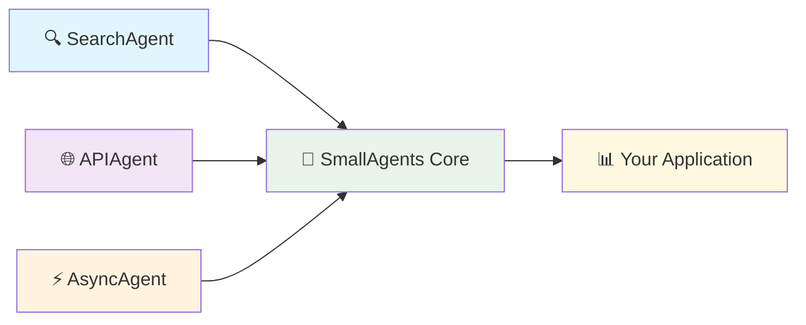
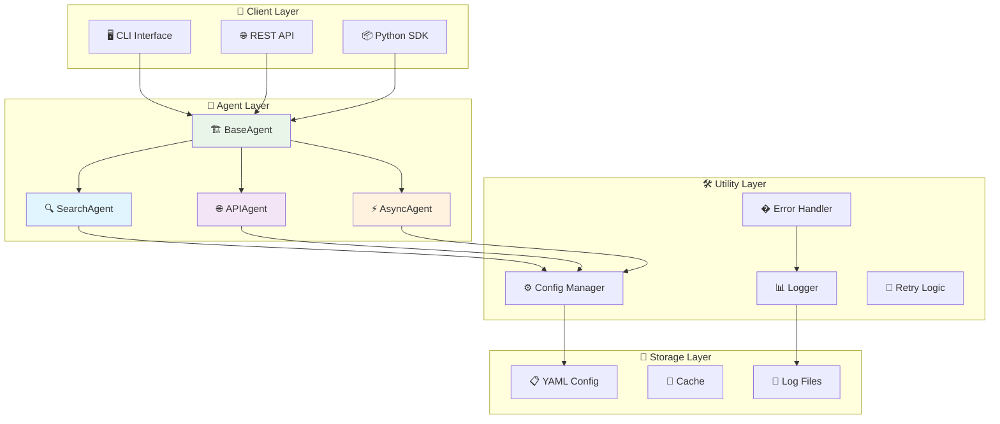

<div align="center">

# 🤖 SmallAgents

### *Lightweight Python Framework for Autonomous Agents*

[](https://github.com/Semir-Harun/SmallAgents/actions)
[](https://www.python.org/downloads/)
[](https://opensource.org/licenses/MIT)
[](https://github.com/astral-sh/ruff)

[](https://hub.docker.com/)
[](https://pytest.org/)
[](https://mypy.readthedocs.io/)
[](https://codecov.io/)

</div>

---

## 🎯 **Purpose**

> **SmallAgents** is a *production-ready* Python framework for building **lightweight, autonomous agents** that can perform complex tasks like web scraping, API interactions, and data processing. Perfect for microservices, automation, and AI-powered workflows.

<div align="center">



</div>

---

## 🛠️ **Tech Stack**

<div align="center">

| Component | Technology | Purpose |
|:---------:|:----------:|:-------:|
| 🐍 **Core** | Python 3.8+ | Modern language with type hints |
| 📋 **Config** | PyYAML | Configuration management |
| 🌐 **HTTP** | requests + aiohttp | Sync & async web requests |
| 🧪 **Testing** | pytest + coverage | Comprehensive test suite |
| 🔍 **Linting** | ruff + mypy | Code quality & type safety |
| 🐳 **Deploy** | Docker + Compose | Containerized deployment |

</div>

---

## ✨ **Features**

<div align="center">

| 🚀 **Performance** | 🔒 **Reliability** | 🧪 **Quality** |
|:------------------:|:------------------:|:---------------:|
| Minimal dependencies | Built-in retry logic | 32 comprehensive tests |
| Lightning-fast execution | Robust error handling | 100% type coverage |
| Concurrent processing | Production-ready | CI/CD automated |

</div>

### 🌟 **Key Highlights**

```diff
+ 🚀 Lightweight & Fast      - Minimal dependencies, maximum performance
+ 🔄 Sync & Async Support    - Both synchronous and asynchronous agents  
+ 🛡️ Production Ready        - Error handling, retries, logging
+ 🧪 Thoroughly Tested       - 32 tests with high coverage
+ 📦 Easy Integration        - Works with existing Python projects
+ 🐳 Docker Ready            - Containerized deployment included
+ 🔧 Type Safe               - Full type hints with mypy validation
+ 📚 Well Documented         - Comprehensive guides and examples
```

---

## 🤖 **Available Agents**

<div align="center">

| Agent | Description | Use Case |
|:-----:|:-----------:|:--------:|
| 🔍 **SearchAgent** | Text search with filtering | Document processing, content discovery |
| 🌐 **APIAgent** | HTTP requests with retries | API integrations, web scraping |
| ⚡ **AsyncSearchAgent** | Concurrent search processing | High-performance batch operations |

</div>

---

## 📁 **Project Structure**

```
🏗️ SmallAgents/
├── 🤖 agents/                     # Core agent implementations
│   ├── 📜 __init__.py              #   Package initialization
│   ├── 🏗️ base_agent.py           #   Synchronous base class
│   ├── ⚡ async_agent.py          #   Asynchronous base class  
│   ├── 🔍 search_agent.py         #   Text search capabilities
│   ├── 🌐 api_agent.py            #   HTTP API interactions
│   └── ⚡ async_search_agent.py   #   Concurrent search processing
├── 🛠️ utils/                      # Utility functions
│   ├── 📜 __init__.py              #   Utility package
│   └── 🔧 helpers.py              #   Helper functions
├── 🧪 tests/                      # Comprehensive test suite
│   ├── 🔬 test_base_agent.py      #   Base agent tests
│   ├── 🔍 test_search_agent.py    #   Search functionality tests
│   ├── 🌐 test_api_agent.py       #   API agent tests
│   └── ⚡ test_async_search_agent.py # Async agent tests
├── 📚 examples/                   # Usage demonstrations
│   ├── 📖 README.md               #   Example documentation
│   └── 💻 basic_usage.py          #   Working code samples
├── 🔄 .github/workflows/          # CI/CD automation
├── ⚙️ config.yaml                 # Configuration template
├── 🚀 main.py                     # CLI entry point
├── 📦 pyproject.toml              # Modern Python packaging
├── 📋 requirements.txt            # Production dependencies
├── 🛠️ requirements-dev.txt        # Development dependencies  
├── 🐳 Dockerfile                  # Container configuration
├── 🐙 docker-compose.yml          # Multi-container setup
├── 📚 README.md                   # This documentation
├── 🤝 CONTRIBUTING.md             # Contribution guidelines
├── 📄 LICENSE                     # MIT License
└── 🙈 .gitignore                  # Git ignore rules
```

---

## 🚀 **Quick Start**

### 🔥 **Option 1: Local Development**

```bash
# 📥 Clone the repository
git clone https://github.com/Semir-Harun/SmallAgents.git
cd SmallAgents

# 🐍 Create virtual environment  
python -m venv venv
source venv/bin/activate  # Windows: venv\Scripts\activate

# 📦 Install dependencies
pip install -r requirements.txt

# 🏃‍♂️ Run your first agent
python main.py --agent search --query "Hello SmallAgents!"
```

### 🐳 **Option 2: Docker (Recommended)**

```bash
# 🚀 One-command start
docker-compose run smallagents

# 🧪 Run tests
docker-compose run smallagents-dev  

# 💻 Interactive development
docker-compose run smallagents-interactive
```

---

## 💻 **Usage Examples**

### � **Basic Search Agent**

```python
from agents.search_agent import SearchAgent

# 🎯 Create and configure agent
agent = SearchAgent({"max_results": 5})

# 🔍 Perform search
result = agent.run(query="Python automation")
print(f"✅ Found {result['result_count']} results!")

for item in result['results']:
    print(f"  📄 {item}")
```

### 🌐 **API Agent with Retry Logic**

```python
from agents.api_agent import APIAgent

# 🔧 Configure with retry settings
agent = APIAgent({
    "base_url": "https://api.github.com",
    "timeout": 30,
    "max_retries": 3
})

# 🌐 Make robust API call
result = agent.run(method="GET", endpoint="/repos/python/cpython")

if result["success"]:
    print(f"⭐ Stars: {result['data']['stargazers_count']}")
else:
    print(f"❌ Error: {result['error']}")
```

### ⚡ **Async Agent for Concurrency**

```python
import asyncio
from agents.async_search_agent import AsyncSearchAgent

async def main():
    # ⚡ Configure concurrent processing
    agent = AsyncSearchAgent({"concurrent_searches": 10})
    
    # � Perform high-speed search
    result = await agent.run(query="machine learning")
    
    print(f"⚡ Processed in {result['execution_time']:.2f}s")
    print(f"📊 Results: {result['result_count']}")

# 🏃‍♂️ Run async code
asyncio.run(main())
```

---

## ⚙️ **Configuration**

Create a `config.yaml` file for customization:

```yaml
# 🔧 SmallAgents Configuration
agents:
  search:
    max_results: 10
    case_sensitive: false
    
  api:
    base_url: "https://api.example.com"
    timeout: 30
    max_retries: 3
    backoff_factor: 0.5
    
  async_search:
    concurrent_searches: 5
    batch_size: 100

# 📊 Logging configuration  
logging:
  level: INFO
  format: "%(asctime)s - %(name)s - %(levelname)s - %(message)s"
```

---

## 🧪 **Development & Testing**

<div align="center">

### 🛠️ **Development Setup**

</div>

```bash
# 📦 Install development tools
pip install -r requirements-dev.txt

# 🧪 Run comprehensive tests  
pytest -v --cov=agents --cov=utils

# 🔍 Check code quality
ruff check . && ruff format --check .

# 🔒 Verify type safety
mypy .

# 📊 Generate coverage report
pytest --cov-report=html
```

### � **Creating Custom Agents**

```python
from agents.base_agent import BaseAgent
from typing import Any, Dict

class 🤖 CustomAgent(BaseAgent):
    """Your custom agent implementation."""
    
    def run(self, **kwargs: Any) -> Dict[str, Any]:
        # 🎯 Implement your logic here
        data = self.process_data(kwargs)
        
        return {
            "success": True,
            "data": data,
            "agent": self.__class__.__name__
        }
    
    def process_data(self, data: Dict[str, Any]) -> Any:
        # 🔄 Custom processing logic
        return f"Processed: {data}"

# 🚀 Usage
agent = CustomAgent({"setting": "value"})
result = agent.run(input="test data")
```

---

## 🏗️ **Architecture**

<div align="center">



</div>

---

## 🤝 **Contributing**

<div align="center">

**We ❤️ contributions! Join our community of developers.**

[](CONTRIBUTING.md)
[](https://github.com/Semir-Harun/SmallAgents/issues)
[](https://github.com/Semir-Harun/SmallAgents/pulls)

</div>

### 📋 **Quick Contribution Guide**

1. 🍴 **Fork** the repository
2. 🌿 **Create** a feature branch: `git checkout -b feature/amazing-feature`
3. 💻 **Commit** your changes: `git commit -m 'Add amazing feature'`
4. 📤 **Push** to branch: `git push origin feature/amazing-feature`
5. 🎯 **Create** a Pull Request

See our [**Contributing Guide**](CONTRIBUTING.md) for detailed instructions.

---

## 📄 **License**

<div align="center">

This project is licensed under the **MIT License** - see the [LICENSE](LICENSE) file for details.

[](LICENSE)

</div>

---

## 🗺️ **Roadmap**

<div align="center">

### 🚀 **Coming Soon**

</div>

| Phase | Features | Status |
|:-----:|:---------|:------:|
| 📊 **v0.2** | Performance benchmarking, metrics dashboard | 🔄 Planning |
| 🔗 **v0.3** | LangChain integration, agent chaining | 📋 Roadmap |
| 🎨 **v0.4** | Web UI for agent management | 💭 Ideas |
| 🔌 **v0.5** | Plugin system, marketplace | 🌟 Future |

### 🎯 **Specific Features**

- [ ] 📁 **File Processing Agents** - Handle documents, images, videos
- [ ] 🗄️ **Database Agents** - SQL, NoSQL, and vector database support  
- [ ] 🔗 **Framework Integration** - LangChain, CrewAI, AutoGen compatibility
- [ ] 🎨 **Web Dashboard** - Visual agent management interface
- [ ] 🔌 **Plugin System** - Extensible agent marketplace
- [ ] 📊 **Performance Tools** - Benchmarking and optimization utilities
- [ ] 🌐 **Multi-language** - Support for JavaScript, Go, Rust agents

---

<div align="center">

## 🌟 **Show Your Support**

**If SmallAgents helped you, please consider giving it a ⭐!**

[](https://github.com/Semir-Harun/SmallAgents/stargazers)
[](https://github.com/Semir-Harun/SmallAgents/network/members)
[](https://github.com/Semir-Harun/SmallAgents/watchers)

**Made with ❤️ by developers, for developers**

---

*Happy Coding! 🚀*

</div>

