# 🤖 Social Media Video Automation Integration

This directory contains the integration of your **Auto-post-to-Social-Media-With-VEO3-and-Blotato** workflow into the SmallAgents framework.

## 📁 Contents

### 🔧 **Core Files**
- `n8n-veo3-blotato-workflow.json` - Original n8n workflow configuration
- `../agents/social_media_video_agent.py` - SmallAgents implementation
- `README.md` - This documentation

### 🎯 **What It Does**

This integration automates the complete video creation and social media posting workflow:

1. **🎬 Content Generation** - Uses OpenAI GPT-4 to generate viral video concepts
2. **🎥 Video Creation** - Leverages Google VEO3 to create realistic videos
3. **📤 Media Upload** - Uploads videos to Blotato for social media distribution
4. **📱 Social Posting** - Automatically posts to multiple platforms:
   - Instagram
   - YouTube  
   - TikTok
   - Facebook
   - Threads
   - Twitter/X
   - LinkedIn
   - Pinterest
   - Bluesky

## 🚀 **Quick Start**

### 1. **Setup Configuration**

```python
from agents.social_media_video_agent import SocialMediaVideoAgent, create_social_media_config

# Create configuration
config = create_social_media_config()

# Add your API keys
config.update({
    "openai_api_key": "sk-your-openai-key",
    "blotato_api_key": "your-blotato-key", 
    "veo3_api_key": "your-veo3-key",
    "social_accounts": {
        "instagram_id": "your-instagram-id",
        "youtube_id": "your-youtube-id",
        # ... other platform IDs
    }
})

# Initialize agent
agent = SocialMediaVideoAgent(config)
```

### 2. **Run Automation**

```python
# Generate and post content
result = agent.run(
    topic="AI cooking robots in action",
    platforms=["instagram", "youtube", "tiktok"]
)

print(f"✅ Posted to {result['successful_posts']} platforms")
```

## 📋 **Configuration Guide**

### **Required API Keys**

| Service | Purpose | Get Key From |
|---------|---------|--------------|
| 🤖 **OpenAI** | Content generation | [OpenAI API](https://platform.openai.com/api-keys) |
| 🎥 **VEO3** | Video generation | [Fal.ai VEO3](https://fal.ai/models/veo3) |
| 📱 **Blotato** | Social media posting | [Blotato API](https://blotato.com/api) |

### **Social Media Account Setup**

For each platform, you need to:
1. Connect your accounts to Blotato
2. Get the account IDs from Blotato dashboard
3. Add them to your configuration

```python
"social_accounts": {
    "instagram_id": "12345",      # From Blotato dashboard
    "youtube_id": "67890",        # Channel ID in Blotato
    "tiktok_id": "54321",         # TikTok account ID
    "facebook_id": "98765",       # Facebook account ID
    "facebook_page_id": "11111",  # Facebook page ID
    # ... etc
}
```

## 🔄 **Workflow Steps**

```mermaid
graph LR
    A[💡 Topic Input] --> B[🎯 Generate Concept]
    B --> C[📝 Create VEO3 Prompt]
    C --> D[🎬 Generate Video]
    D --> E[📤 Upload to Blotato]
    E --> F[📱 Post to Platforms]
    F --> G[✅ Results]
    
    style A fill:#e1f5fe
    style B fill:#f3e5f5
    style C fill:#fff3e0
    style D fill:#e8f5e8
    style E fill:#fff8e1
    style F fill:#fce4ec
    style G fill:#e0f2f1
```



## 💻 **Advanced Usage**

### **Custom Content Generation**

```python
# Generate specific concept
concept = agent.generate_video_concept("robot chef making pizza")

# Create custom VEO3 prompt
prompt = agent.create_veo3_prompt(
    idea="Robot flips pizza dough with precision",
    environment="Modern kitchen with industrial equipment, warm lighting"
)

# Generate video
video_url = agent.generate_video_with_veo3(prompt)
```

### **Selective Platform Posting**

```python
# Post only to specific platforms
result = agent.run(
    topic="sustainable farming techniques",
    platforms=["youtube", "linkedin"]  # Professional platforms only
)

# Post to all configured platforms
result = agent.run(topic="viral dance challenge")  # Uses default platforms
```

### **Batch Processing**

```python
topics = [
    "AI in healthcare",
    "Sustainable energy solutions", 
    "Future of transportation",
    "Space exploration advances"
]

for topic in topics:
    print(f"🚀 Processing: {topic}")
    result = agent.run(topic=topic, platforms=["youtube", "linkedin"])
    time.sleep(60)  # Rate limiting
```

## 🧪 **Testing**

### **Run Tests**

```bash
# Test the social media agent
python -m pytest tests/test_social_media_video_agent.py -v

# Test with demo mode (uses test video)
python agents/social_media_video_agent.py
```

### **Demo Mode**

The agent includes fallbacks for testing:
- Uses demo video if VEO3 fails
- Provides error handling for API failures
- Logs detailed progress information

## 🔧 **Troubleshooting**

### **Common Issues**

| Issue | Solution |
|-------|----------|
| ❌ VEO3 timeout | Increase `video_wait_time` in config |
| ❌ API key invalid | Check key format and permissions |
| ❌ Platform posting fails | Verify account IDs in Blotato |
| ❌ Rate limits | Add delays between requests |

### **Error Handling**

The agent provides comprehensive error handling:

```python
result = agent.run(topic="test topic")

if not result["success"]:
    print(f"❌ Workflow failed: {result.get('error', 'Unknown error')}")
    
    # Check individual platform results
    for platform, post_result in result["social_posts"].items():
        if not post_result["success"]:
            print(f"  {platform}: {post_result['error']}")
```

## 📈 **Performance & Scaling**

### **Optimization Tips**

- **Parallel Processing**: Post to multiple platforms simultaneously
- **Caching**: Cache generated concepts for similar topics
- **Rate Limiting**: Respect API rate limits with delays
- **Monitoring**: Track success rates and performance metrics

### **Production Deployment**

```python
# Use with task scheduling
import schedule

def daily_content():
    topics = ["trending topic 1", "trending topic 2"]
    for topic in topics:
        agent.run(topic=topic)

schedule.every().day.at("09:00").do(daily_content)
```

## 🤝 **Contributing**

To extend this integration:

1. Add new social media platforms in `post_to_social_platform()`
2. Enhance content generation with additional AI models
3. Add analytics and performance tracking
4. Implement advanced scheduling features

## 📄 **License**

This integration is part of SmallAgents and follows the same MIT License.

---

**Need help?** Check the [main SmallAgents documentation](../README.md) or create an issue on GitHub.